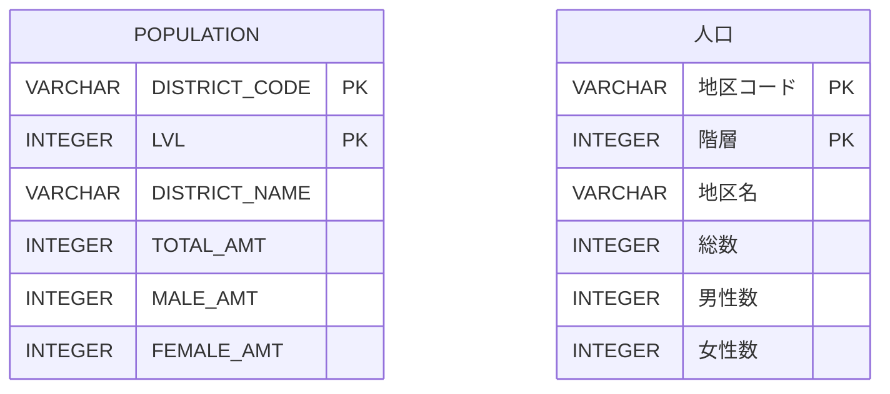

# [都道府県の人口](https://web.archive.org/web/20250208220740/https://topsic-contest.jp/contests/practice/problems/practice001)

-   配点 : 10点
-   難易度 : 1
-   制限実行時間 : 1000ms
-   制限メモリ使用量 : 128 MB

## 問題

地域毎に人口を集計した人口テーブルより、都道府県の人口一覧を表示しなさい。ただし、階層=2のデータを対象とする。

表示項目は以下とする。(エイリアスを使用し→の項目名とする)

-   DISTRICT_NAME → 都道府県名
-   TOTAL_AMT → 総人口

表示順

1.  総人口の降順

※出典：[政府統計の総合窓口(e-Stat)](https://www.e-stat.go.jp/)「令和2年国勢調査 人口等基本集計」を加工して作成

## 表示フォーマット

※あくまでフォーマットを示すもので、正解例ではありません。行数も正解とは異なります。

|都道府県名　|総人口   |
|:---------|-------:|
|東京都　　　|13844009|
|神奈川県　　| 8743513|
|大阪府　　　| 8478518|
|千葉県　　　| 4823612|
|北海道　　　| 3973007|

## ER図 (半角:物理名、全角:論理名)

## テーブル定義

### POPULATION

| 主キー | 列名　          | データ型　　| 必須　| デフォルト値 |
|:------|:---------------|:----------|:-----|:-----------|
| ✔︎     | DISTRICT_CODE  | VARCHAR   | ✔︎    | NULL       |
| ✔︎     | LVL            | INTEGER   | ✔︎    | NULL       |
|       | DISTRICT_NAME  | VARCHAR   |      | NULL       |
|       | TOTAL_AMT      | INTEGER   |      | NULL       |
|       | MALE_AMT       | INTEGER   |      | NULL       |
|       | FEMALE_AMT     | INTEGER   |      | NULL       |

## サンプルデータ

### POPULATION

| DISTRICT_CODE | LVL | DISTRICT_NAME   | TOTAL_AMT | MALE_AMT | FEMALE_AMT |
|:--------------|:----|:----------------|:----------|:---------|:-----------|
| 0             | 1   | 全国　　　　      | 88285927  | 42973052 | 45312875   |
| 1000          | 2   | 北海道　　　      | 3973007   | 1862742  | 2110265    |
| 1100          | 4   | 札幌市　　　      | 1916037   | 891974   | 1024063    |
| 12000         | 2   | 千葉県　　　      | 4823612   | 2394539  | 2429073    |
| 13000         | 2   | 東京都　　　      | 13844009  | 6796702  | 7047307    |
| 13100         | 4   | 特別区部　　      | 9733276   | 4774402  | 4958874    |
| 13101         | 4   | 千代田区　　      | 66680     | 33637    | 33043      |
| 13102         | 4   | 中央区　　　      | 169179    | 80931    | 88248      |
| 13103         | 4   | 港区　　　　      | 260486    | 123410   | 137076     |
| 13104         | 4   | 新宿区　　　      | 349385    | 174822   | 174563     |
| 13105         | 4   | 文京区　　　      | 240069    | 115483   | 124586     |
| 13106         | 4   | 台東区　　　      | 211444    | 108586   | 102858     |
| 13107         | 4   | 墨田区　　　      | 272085    | 134787   | 137298     |
| 13108         | 4   | 江東区　　　      | 524310    | 258015   | 266295     |
| 13109         | 4   | 品川区　　　      | 422488    | 208688   | 213800     |
| 13110         | 4   | 目黒区　　　      | 288088    | 135820   | 152268     |
| 13111         | 4   | 大田区　　　      | 748081    | 372464   | 375617     |
| 13112         | 4   | 世田谷区　　      | 943664    | 445592   | 498072     |
| 13113         | 4   | 渋谷区　　　      | 243883    | 117907   | 125976     |
| 13114         | 4   | 中野区　　　      | 344880    | 172525   | 172355     |
| 13115         | 4   | 杉並区　　　      | 591108    | 284301   | 306807     |
| 13116         | 4   | 豊島区　　　      | 301599    | 151020   | 150579     |
| 13117         | 4   | 北区　　　　      | 355213    | 176289   | 178924     |
| 13118         | 4   | 荒川区　　　      | 217475    | 107683   | 109792     |
| 13119         | 4   | 板橋区　　　      | 584483    | 286179   | 298304     |
| 13120         | 4   | 練馬区　　　      | 752608    | 361770   | 390838     |
| 13121         | 4   | 足立区　　　      | 695043    | 347408   | 347635     |
| 13122         | 4   | 葛飾区　　　      | 453093    | 225758   | 227335     |
| 13123         | 4   | 江戸川区　　      | 697932    | 351327   | 346605     |
| 13201         | 4   | 八王子市　　      | 525295    | 263997   | 261298     |
| 14000         | 2   | 神奈川県　　      | 8743513   | 4347333  | 4396180    |
| 14100         | 4   | 横浜市　　　      | 3688620   | 1825165  | 1863455    |
| 14130         | 4   | 川崎市　　　      | 1527291   | 770615   | 756676     |
| 14212         | 4   | 厚木市　　　      | 194615    | 100948   | 93667      |
| 14213         | 4   | 大和市　　　      | 237810    | 118896   | 118914     |
| 14214         | 4   | 伊勢原市　　      | 79937     | 40374    | 39563      |
| 14215         | 4   | 海老名市　　      | 127325    | 64174    | 63151      |
| 14216         | 4   | 座間市　　　      | 124805    | 62327    | 62478      |
| 14217         | 4   | 南足柄市　　      | 31957     | 15628    | 16329      |
| 14218         | 4   | 綾瀬市　　　      | 73952     | 37545    | 36407      |
| 26000         | 2   | 京都府　　　      | 2176168   | 1038387  | 1137781    |
| 26100         | 4   | 京都市　　　      | 1397972   | 660973   | 736999     |
| 26201         | 4   | 福知山市　　      | 39021     | 19973    | 19048      |
| 26213         | 4   | 南丹市　　　      | 8043      | 4126     | 3917       |
| 26214         | 4   | 木津川市　　      | 47046     | 22476    | 24570      |
| 27000         | 2   | 大阪府　　　      | 8478518   | 4064707  | 4413811    |
| 27100         | 4   | 大阪市　　　      | 2752002   | 1326721  | 1425281    |
| 27140         | 4   | 堺市　　　　      | 788173    | 375630   | 412543     |
| 27202         | 4   | 岸和田市　　      | 174616    | 82725    | 91891      |
| 27232         | 4   | 阪南市　　　      | 34121     | 15970    | 18151      |
| 40000         | 2   | 福岡県　　　      | 3786685   | 1794326  | 1992359    |
| 40100         | 4   | 北九州市　　      | 852316    | 403002   | 449314     |
| 40130         | 4   | 福岡市　　　      | 1564151   | 738228   | 825923     |
| 8000          | 2   | 茨城県　　　      | 1169451   | 586335   | 583116     |
| 8201          | 4   | 水戸市　　　      | 174150    | 85366    | 88784      |
| 8202          | 4   | 日立市　　　      | 145634    | 73059    | 72575      |
| 8235          | 4   | つくばみらい市　　 | 12778     | 6457     | 6321       |
