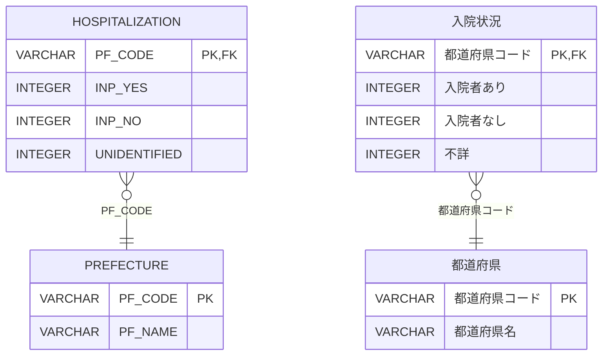

# [世帯入院率](https://web.archive.org/web/20250208220740/https://topsic-contest.jp/contests/practice/problems/practice002)

-   配点 : 20点
-   難易度 : 2
-   制限実行時間 : 1000ms
-   制限メモリ使用量 : 128 MB

## 問題

都道府県毎に入院状況を集計した入院状況データより、都道府県別に入院率を算出し、入院率が高い順に表示しなさい。入院状況データは都道府県別の入院状況を世帯単位で集計したデータである。

入院率は以下の数式で求め、小数点第2位を四捨五入する。ただし、四捨五入を行った結果整数となった場合、小数点以下は表示せずに出力せよ。(例: 4.02 → 4.0 のとき、4 と出力)

表示順の入院率は四捨五入後の値を基準にすること。

```math
( \frac{入院者あり}{入院者あり + 入院者なし + 不詳} \times 100 )
```

表示項目は以下とする。(エイリアスを使用し→の項目名とする)

-   PF_CODE → 都道府県コード
-   PF_NAME → 都道府県名
-   都道府県毎の入院率 → 入院率

表示順

1.  入院率の降順
2.  都道府県コードの昇順

※出典：[政府統計の総合窓口(e-Stat)](https://www.e-stat.go.jp/)「令和元年国民生活基礎調査 健康 都道府県編」を加工して作成

## 表示フォーマット

※あくまでフォーマットを示すもので、正解例ではありません。行数も正解とは異なります。

| 都道府県コード　　| 都道府県名　| 入院率 |
|:---------------|:----------|:------|
| 7000           | 福島県     | 4.8   |
| 3000           | 岩手県     | 4     |
| 6000           | 山形県     | 3.9   |
| 9000           | 栃木県     | 3.7   |
| 8000           | 茨城県     | 3.5   |

## ER図 (半角:物理名、全角:論理名)



## テーブル定義

### HOSPITALIZATION

| 主キー | 列名　          | データ型　　| 必須　| デフォルト値 |
|:------|:---------------|:----------|:-----|:-----------|
| ✔︎     | PF_CODE        | VARCHAR   | ✔︎    | NULL       |
|       | INP_YES        | INTEGER   |      | NULL       |
|       | INP_NO         | INTEGER   |      | NULL       |
|       | UNIDENTIFIED   | INTEGER   |      | NULL       |

### PREFECTURE

| 主キー | 列名　          | データ型　　| 必須　| デフォルト値 |
|:------|:---------------|:----------|:-----|:-----------|
| ✔︎     | PF_CODE        | VARCHAR   | ✔︎    | NULL       |
|       | PF_NAME        | VARCHAR   |      | NULL       |

## サンプルデータ

### HOSPITALIZATION

| PF_CODE | INP_YES | INP_NO | UNIDENTIFIED |
|--------:|--------:|-------:|-------------:|
| 1000    |      82 |   2355 |           20 |
| 2000    |      13 |    495 |            2 |
| 3000    |      19 |    458 |            3 |
| 4000    |      31 |    884 |            9 |
| 5000    |      13 |    362 |            2 |
| 6000    |      15 |    365 |            3 |
| 7000    |      33 |    653 |            7 |
| 8000    |      37 |   1016 |           13 |
| 9000    |      27 |    705 |            4 |
| 10000   |      26 |    724 |            7 |

### PREFECTURE

| PF_CODE | PF_NAME   |
|:--------|:----------|
| 1000    | 北海道     |
| 10000   | 群馬県     |
| 11000   | 埼玉県     |
| 12000   | 千葉県     |
| 13000   | 東京都     |
| 14000   | 神奈川県　　|
| 15000   | 新潟県     |
| 16000   | 富山県     |
| 17000   | 石川県     |
| 18000   | 福井県     |
| 19000   | 山梨県     |
| 2000    | 青森県     |
| 20000   | 長野県     |
| 21000   | 岐阜県     |
| 22000   | 静岡県     |
| 23000   | 愛知県     |
| 24000   | 三重県     |
| 25000   | 滋賀県     |
| 26000   | 京都府     |
| 27000   | 大阪府     |
| 28000   | 兵庫県     |
| 29000   | 奈良県     |
| 3000    | 岩手県     |
| 30000   | 和歌山県　　|
| 31000   | 鳥取県     |
| 32000   | 島根県     |
| 33000   | 岡山県     |
| 34000   | 広島県     |
| 35000   | 山口県     |
| 36000   | 徳島県     |
| 37000   | 香川県     |
| 38000   | 愛媛県     |
| 39000   | 高知県     |
| 4000    | 宮城県     |
| 40000   | 福岡県     |
| 41000   | 佐賀県     |
| 42000   | 長崎県     |
| 43000   | 熊本県     |
| 44000   | 大分県     |
| 45000   | 宮崎県     |
| 46000   | 鹿児島県　　|
| 47000   | 沖縄県     |
| 5000    | 秋田県     |
| 6000    | 山形県     |
| 7000    | 福島県     |
| 8000    | 茨城県     |
| 9000    | 栃木県     |
