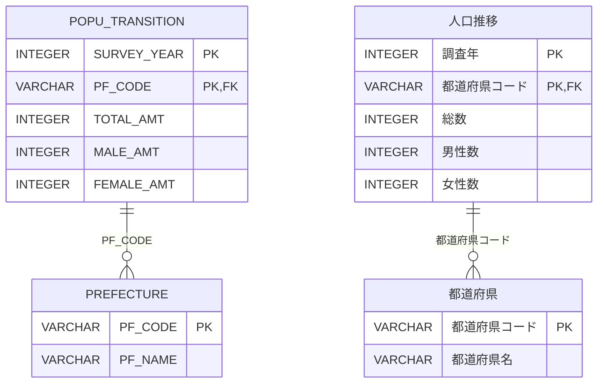

# [人口増加率分析](https://web.archive.org/web/20221012010550/https://topsic-contest.jp/contests/practice/problems/practice003)

-   配点 : 30点
-   難易度 : 3
-   制限実行時間 : 1000ms
-   制限メモリ使用量 : 128 MB

## 問題

調査年毎に都道府県の人口を集計した人口推移データより、2015年から2020年の期間で人口が増加した都道府県を抽出しなさい。人口増加率の小数点以下は四捨五入とする。ただし、人口が変化していない都道府県は存在しないことが保証されている。

表示項目は以下とする。(エイリアスを使用し→の項目名とする)

-   PF_CODE → 都道府県コード
-   PF_NAME → 都道府県名
-   2015年のTOTAL_AMT → 総人口2015年
-   2020年のTOTAL_AMT → 総人口2020年
-   人口増加率を%で表示(小数点以下は四捨五入) → 人口増加率

表示順

1.  人口増加率の降順
2.  都道府県コードの昇順

※出典：[政府統計の総合窓口(e-Stat)](https://www.e-stat.go.jp/)「令和2年国勢調査_時系列データ男女、年齢、配偶関係」を加工して作成

## 表示フォーマット

※あくまでフォーマットを示すもので、正解例ではありません。行数も正解とは異なります。

| 都道府県コード　　| 都道府県名　| 総人口2015年　　| 総人口2020年　　| 人口増加率　|
|:---------------|:----------|--------------:|--------------:|:----------|
| 13000          | 東京都     | 13515271      | 14047594      | 104       |
| 11000          | 埼玉県     | 7266534       | 7344765       | 101       |
| 12000          | 千葉県     | 6222666       | 6284480       | 101       |
| 14000          | 神奈川県　　| 9126214       | 9237337       | 101       |

## ER図 (半角:物理名、全角:論理名)

## テーブル定義

### POPU_TRANSITION

| 主キー | 列名　          | データ型　　| 必須　| デフォルト値 |
|:------|:---------------|:----------|:-----|:-----------|
| ✔︎     |SURVEY_YEAR     |INTEGER    | ✔︎    | NULL       |
| ✔︎     |PF_CODE         |VARCHAR    | ✔︎    | NULL       |
|       |TOTAL_AMT       |INTEGER    |      | NULL       |
|       |MALE_AMT        |INTEGER    |      | NULL       |
|       |FEMALE_AMT      |INTEGER    |      | NULL       |

### PREFECTURE

| 主キー | 列名　          | データ型　　| 必須　| デフォルト値 |
|:------|:---------------|:----------|:-----|:-----------|
| ✔︎     |PF_CODE         |VARCHAR    | ✔︎    | NULL       |
|       |PF_NAME         |VARCHAR    |      | NULL       |

## サンプルデータ

### POPU_TRANSITION

| SURVEY_YEAR | PF_CODE  | TOTAL_AMT | MALE_AMT | FEMALE_AMT |
|:-----------:|:--------:|----------:|---------:|-----------:|
| 2010        | 1000     |  5506419  | 2603345  | 2903074    |
| 2010        | 2000     |  1373339  |  646141  |  727198    |
| 2010        | 3000     |  1330147  |  634971  |  695176    |
| 2010        | 4000     |  2348165  | 1139566  | 1208599    |
| 2015        | 1000     |  5381733  | 2537089  | 2844644    |
| 2015        | 10000    |  1973115  |  973283  |  999832    |
| 2015        | 11000    |  7266534  | 3628418  | 3638116    |
| 2015        | 12000    |  6222666  | 3095860  | 3126806    |
| 2015        | 13000    | 13515271  | 6666690  | 6848581    |
| 2015        | 14000    |  9126214  | 4558978  | 4567236    |
| 2015        | 15000    |  2304264  | 1115413  | 1188851    |
| 2015        | 16000    |  1066328  |  515147  |  551181    |
| 2015        | 17000    |  1154008  |  558589  |  595419    |
| 2015        | 18000    |   786740  |  381474  |  405266    |
| 2015        | 19000    |   834930  |  408327  |  426603    |
| 2015        | 2000     |  1308265  |  614694  |  693571    |
| 2015        | 3000     |  1279594  |  615584  |  664010    |
| 2015        | 4000     |  2333899  | 1140167  | 1193732    |
| 2015        | 5000     |  1023119  |  480336  |  542783    |
| 2015        | 6000     |  1123891  |  540226  |  583665    |
| 2015        | 7000     |  1914039  |  945660  |  968379    |
| 2015        | 8000     |  2916976  | 1453594  | 1463382    |
| 2015        | 9000     |  1974255  |  981626  |  992629    |
| 2020        | 1000     |  5224614  | 2465088  | 2759526    |
| 2020        | 10000    |  1939110  |  959411  |  979699    |
| 2020        | 11000    |  7344765  | 3652169  | 3692596    |
| 2020        | 12000    |  6284480  | 3117987  | 3166493    |
| 2020        | 13000    | 14047594  | 6898388  | 7149206    |
| 2020        | 14000    |  9237337  | 4588268  | 4649069    |
| 2020        | 15000    |  2201272  | 1068670  | 1132602    |
| 2020        | 16000    |  1034814  |  502637  |  532177    |
| 2020        | 17000    |  1132526  |  549771  |  582755    |
| 2020        | 18000    |   766863  |  373973  |  392890    |
| 2020        | 19000    |   809974  |  397309  |  412665    |
| 2020        | 2000     |  1237984  |  583402  |  654582    |
| 2020        | 3000     |  1210534  |  582952  |  627582    |
| 2020        | 4000     |  2301996  | 1122598  | 1179398    |
| 2020        | 5000     |   959502  |  452439  |  507063    |
| 2020        | 6000     |  1068027  |  516438  |  551589    |
| 2020        | 7000     |  1833152  |  903864  |  929288    |
| 2020        | 8000     |  2867009  | 1430976  | 1436033    |
| 2020        | 9000     |  1933146  |  964930  |  968216    |

### PREFECTURE

| PF_CODE | PF_NAME   |
|:--------|:----------|
| 1000    | 北海道    |
| 10000   | 群馬県    |
| 11000   | 埼玉県    |
| 12000   | 千葉県    |
| 13000   | 東京都    |
| 14000   | 神奈川県  |
| 15000   | 新潟県    |
| 16000   | 富山県    |
| 17000   | 石川県    |
| 18000   | 福井県    |
| 19000   | 山梨県    |
| 2000    | 青森県    |
| 20000   | 長野県    |
| 21000   | 岐阜県    |
| 22000   | 静岡県    |
| 23000   | 愛知県    |
| 24000   | 三重県    |
| 25000   | 滋賀県    |
| 26000   | 京都府    |
| 27000   | 大阪府    |
| 28000   | 兵庫県    |
| 29000   | 奈良県    |
| 3000    | 岩手県    |
| 30000   | 和歌山県  |
| 31000   | 鳥取県    |
| 32000   | 島根県    |
| 33000   | 岡山県    |
| 34000   | 広島県    |
| 35000   | 山口県    |
| 36000   | 徳島県    |
| 37000   | 香川県    |
| 38000   | 愛媛県    |
| 39000   | 高知県    |
| 4000    | 宮城県    |
| 40000   | 福岡県    |
| 41000   | 佐賀県    |
| 42000   | 長崎県    |
| 43000   | 熊本県    |
| 44000   | 大分県    |
| 45000   | 宮崎県    |
| 46000   | 鹿児島県  |
| 47000   | 沖縄県    |
| 5000    | 秋田県    |
| 6000    | 山形県    |
| 7000    | 福島県    |
| 8000    | 茨城県    |
| 9000    | 栃木県    |
