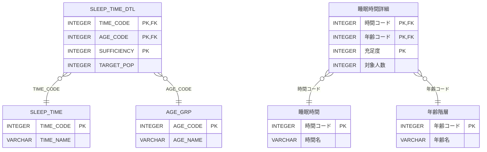

# [年齢別睡眠時間分析](https://web.archive.org/web/20221012010550/https://topsic-contest.jp/contests/practice/problems/practice004)

-   配点 : 40点
-   難易度 : 4
-   制限実行時間 : 1000ms
-   制限メモリ使用量 : 128 MB

## 問題

年齢層睡眠時間毎に人数を集計した睡眠時間詳細データを、年齢層を縦軸、睡眠時間を横軸にした表形式で表示しなさい。
睡眠時間詳細データは年齢コードと時間コードの組合せに歯抜けは無いものとする、また、対象人数の単位は千人となっている。

表示項目は以下とする。（エイリアスを使用し→の項目名とする）

-   AGE_NAME → 年齢階層
-   年齢層毎に集計した、TIME_CODE = 120の人数 → 5時間未満
-   年齢層毎に集計した、TIME_CODE = 130の人数 → 5時間以上6時間未満
-   年齢層毎に集計した、TIME_CODE = 140の人数 → 6時間以上7時間未満
-   年齢層毎に集計した、TIME_CODE = 150の人数 → 7時間以上8時間未満
-   年齢層毎に集計した、TIME_CODE = 160の人数 → 8時間以上9時間未満
-   年齢層毎に集計した、TIME_CODE = 170の人数 → 9時間以上
-   年齢層毎に集計した、TIME_CODE = 180の人数 → 不詳

表示順

1.  年齢コードの昇順

※出典：[政府統計の総合窓口(e-Stat)](https://www.e-stat.go.jp/)「令和元年国民生活基礎調査 健康 都道府県編」を加工して作成

## 表示フォーマット

| 年齢階層　　| 5時間未満　　| 5時間以上6時間未満　| 6時間以上7時間未満　| 7時間以上8時間未満　| 8時間以上9時間未満　| 9時間以上　　| 不詳　|
|:----------|:-----------|:-----------------|:-----------------|:-----------------|:-----------------|:-----------|:-----|
| 12～14歳　 | 21         | 24               | 135              | 398              | 510              | 40         | 0    |
| 15～19歳　 | 79         | 110              | 298              | 402              | 136              | 34         | 2    |
| 20～24歳　 | 86         | 81               | 1389             | 332              | 115              | 57         | 2    |
| 25～29歳　 | 270        | 72               | 1268             | 292              | 191              | 47         | 3    |
| 30～34歳　 | 14         | 930              | 285              | 347              | 241              | 31         | 5    |

## ER図 (半角:物理名、全角:論理名)

## テーブル定義

### AGE_GRP

| 主キー | 列名　          | データ型　　| 必須　| デフォルト値 |
|:------|:---------------|:----------|:-----|:-----------|
| ✔︎     | AGE_CODE       | INTEGER   | ✔︎    | NULL       |
|       | AGE_NAME       | VARCHAR   |      | NULL       |

### SLEEP_TIME

| 主キー | 列名　          | データ型　　| 必須　| デフォルト値 |
|:------|:---------------|:----------|:-----|:-----------|
| ✔︎     | TIME_CODE      | INTEGER   | ✔︎    | NULL       |
|       | TIME_NAME      | VARCHAR   |      | NULL       |

### SLEEP_TIME_DTL

| 主キー | 列名　          | データ型　　| 必須　| デフォルト値 |
|:------|:---------------|:----------|:-----|:-----------|
| ✔︎     | TIME_CODE      | INTEGER   | ✔︎    | NULL       |
| ✔︎     | AGE_CODE       | INTEGER   | ✔︎    | NULL       |
| ✔︎     | SUFFICIENCY    | INTEGER   | ✔︎    | NULL       |
|       | TARGET_POP     | INTEGER   |      | NULL       |

## サンプルデータ

### AGE_GRP

| AGE_CODE | AGE_NAME  |
|:---------|:----------|
| 1        | 11歳以下   |
| 2        | 12～14歳　 |
| 3        | 15～19歳　 |
| 4        | 20～24歳　 |
| 5        | 25～29歳　 |
| 6        | 30～34歳　 |
| 7        | 35～39歳　 |
| 8        | 40～44歳　 |
| 9        | 45～49歳　 |
| 10       | 50～54歳　 |
| 11       | 55～59歳　 |
| 12       | 60～64歳　 |
| 13       | 65～69歳　 |
| 14       | 70～74歳　 |
| 15       | 75～79歳　 |
| 16       | 80～84歳　 |
| 17       | 85歳以上   |

### SLEEP_TIME

| TIME_CODE | TIME_NAME        |
|:----------|:-----------------|
| 120       | 5時間未満　　      |
| 130       | 5時間以上6時間未満　|
| 140       | 6時間以上7時間未満　|
| 150       | 7時間以上8時間未満　|
| 160       | 8時間以上9時間未満　|
| 170       | 9時間以上　　      |
| 180       | 不詳　            |

### SLEEP_TIME_DTL

| TIME_CODE | AGE_CODE | SUFFICIENCY | TARGET_POP |
|:---------:|:--------:|:-----------:|:----------:|
| 120       | 2        | 130         | 6          |
| 120       | 2        | 140         | 11         |
| 120       | 2        | 150         | 4          |
| 120       | 3        | 120         | 10         |
| 120       | 3        | 130         | 69         |
| 120       | 4        | 120         | 11         |
| 120       | 4        | 130         | 75         |
| 120       | 5        | 120         | 8          |
| 120       | 5        | 130         | 66         |
| 120       | 5        | 140         | 155        |
| 120       | 5        | 150         | 41         |
| 120       | 6        | 120         | 14         |
| 130       | 2        | 120         | 17         |
| 130       | 2        | 150         | 7          |
| 130       | 3        | 120         | 87         |
| 130       | 3        | 150         | 23         |
| 130       | 4        | 120         | 81         |
| 130       | 5        | 120         | 72         |
| 130       | 6        | 120         | 88         |
| 130       | 6        | 130         | 842        |
| 140       | 2        | 120         | 131        |
| 140       | 2        | 150         | 4          |
| 140       | 3        | 120         | 298        |
| 140       | 4        | 120         | 265        |
| 140       | 4        | 130         | 1124       |
| 140       | 5        | 120         | 219        |
| 140       | 5        | 130         | 1049       |
| 140       | 6        | 120         | 269        |
| 140       | 6        | 150         | 16         |
| 150       | 2        | 120         | 398        |
| 150       | 3        | 120         | 399        |
| 150       | 3        | 150         | 3          |
| 150       | 4        | 120         | 328        |
| 150       | 4        | 150         | 4          |
| 150       | 5        | 120         | 292        |
| 150       | 6        | 120         | 347        |
| 160       | 2        | 120         | 273        |
| 160       | 2        | 130         | 237        |
| 160       | 3        | 120         | 136        |
| 160       | 4        | 120         | 115        |
| 160       | 5        | 120         | 99         |
| 160       | 5        | 130         | 92         |
| 160       | 6        | 120         | 117        |
| 160       | 6        | 130         | 124        |
| 170       | 2        | 120         | 40         |
| 170       | 3        | 120         | 34         |
| 170       | 4        | 120         | 36         |
| 170       | 4        | 130         | 21         |
| 170       | 5        | 120         | 28         |
| 170       | 5        | 130         | 19         |
| 170       | 6        | 120         | 30         |
| 170       | 6        | 150         | 1          |
| 180       | 2        | 140         | 0          |
| 180       | 2        | 150         | 0          |
| 180       | 3        | 140         | 2          |
| 180       | 3        | 150         | 0          |
| 180       | 4        | 140         | 2          |
| 180       | 4        | 150         | 0          |
| 180       | 5        | 140         | 3          |
| 180       | 5        | 150         | 0          |
| 180       | 6        | 150         | 5          |
