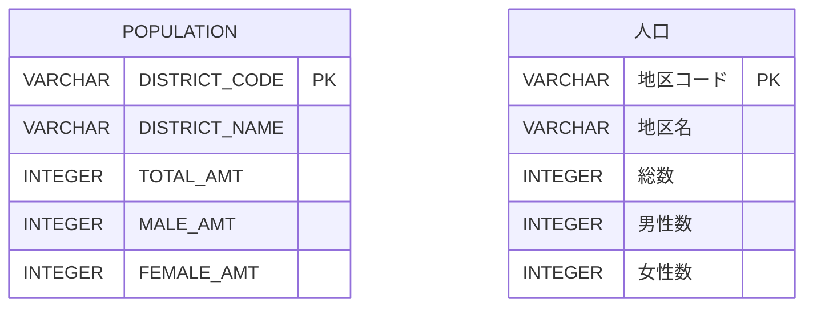

# [東京都の人口](https://web.archive.org/web/20250208220740/https://topsic-contest.jp/contests/contest001/problems/contest001-1)

-   配点 : 10点
-   難易度 : 1
-   制限実行時間 : 1000ms
-   制限メモリ使用量 : 128 MB

## 問題

東京都の人口集中地区の人口を集計した人口テーブルより、東京都の人口一覧を表示しなさい。

表示項目は以下とする。（エイリアスを使用し→の項目名とする）

-   DISTRICT_CODE → 地区コード
-   DISTRICT_NAME → 地区名
-   TOTAL_AMT → 総人口

表示順

1.  総人口の降順
2.  地区コードの降順

※出典：[政府統計の総合窓口(e-Stat)](https://www.e-stat.go.jp/)「令和2年国勢調査 人口等基本集計」を加工して作成

## 表示フォーマット

| 地区コード　| 地区名     | 総人口    |
|:----------|:----------|:---------|
| 13201     | 八王子市　　| 525295   |
| 13104     | 新宿区     | 349385   |
| 13103     | 港区　     | 260486   |
| 13105     | 文京区     | 240069   |
| 13204     | 三鷹市     | 195391   |

## ER図 (半角:物理名、全角:論理名)

## テーブル定義

### POPULATION

| 主キー | 列名　          | データ型　　| 必須　| デフォルト値 |
|:------|:---------------|:----------|:-----|:-----------|
| ✔︎     | DISTRICT_CODE  | VARCHAR 　| ✔︎    | NULL       |
|       | DISTRICT_NAME  | VARCHAR 　|      | NULL       |
|       | TOTAL_AMT      | INTEGER 　|      | NULL       |
|       | MALE_AMT       | INTEGER 　|      | NULL       |
|       | FEMALE_AMT     | INTEGER 　|      | NULL       |

## サンプルデータ

### POPULATION

| DISTRICT_CODE | DISTRICT_NAME | TOTAL_AMT | MALE_AMT | FEMALE_AMT |
|:--------------|:--------------|:----------|:---------|:-----------|
| 13101         | 千代田区　　    | 66680     | 33637    | 33043      |
| 13102         | 中央区         | 169179    | 80931    | 88248      |
| 13103         | 港区　         | 260486    | 123410   | 137076     |
| 13104         | 新宿区         | 349385    | 174822   | 174563     |
| 13105         | 文京区         | 240069    | 115483   | 124586     |
| 13201         | 八王子市　　    | 525295    | 263997   | 261298     |
| 13202         | 立川市         | 182834    | 90844    | 91990      |
| 13203         | 武蔵野市　　    | 150149    | 71868    | 78281      |
| 13204         | 三鷹市         | 195391    | 94489    | 100902     |
| 13205         | 青梅市         | 105591    | 53042    | 52549      |
