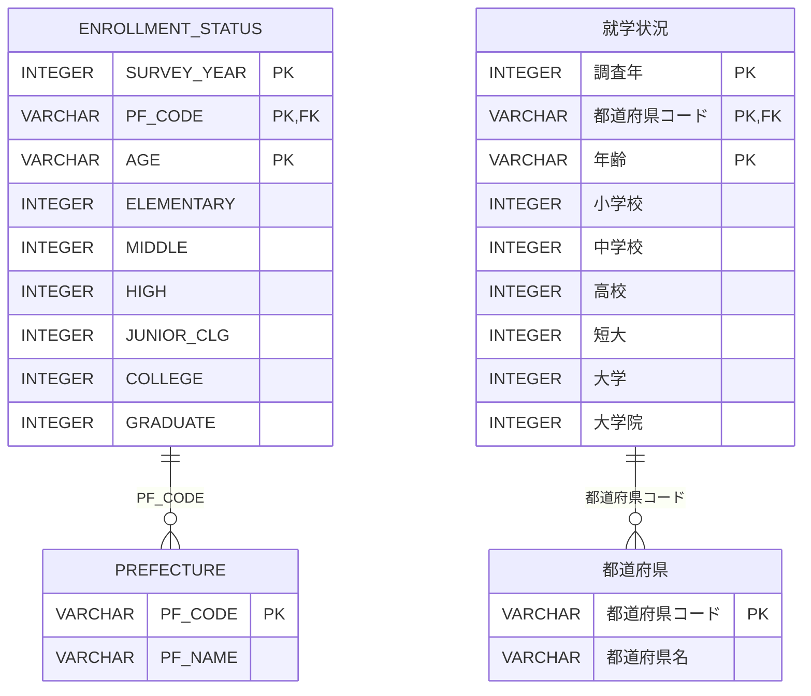

# [就学状況の表示変換](https://web.archive.org/web/20250208220740/https://topsic-contest.jp/contests/contest002/problems/contest002-4)

-   配点 : 40点
-   難易度 : 4
-   制限実行時間 : 1000ms
-   制限メモリ使用量 : 128 MB

## 問題

都道府県毎に就学状況の人数を集計した就学状況データがある。都道府県、年齢別に就学先が横持ちで人数集計されているが、表示例のように都道府県、就学先で1レコードとなるように集計して縦持ちのデータに変換しなさい。また、集計対象とするのは、調査年が2020年のデータのみとし、KINDに表示する文言は、就学先の論理名とする。ただし、集計値がNULLのデータは表示対象としない。

表示項目は以下とする。(エイリアスを使用し→の項目名とする)

-   SURVEY_YEAR → SV_YEAR
-   PF_NAME → PREFECTURE
-   集計した就学先の種類 → KIND
-   就学先ごとに集計した人数 → AMT

表示順

1.  都道府県コードの昇順
2.  就学状況データの就学先を左から並べた順番（小学校→…→大学院）

※出典：[政府統計の総合窓口(e-Stat)](https://www.e-stat.go.jp/)「令和２年国勢調査 就業状態等基本集計」を加工して作成

## 表示フォーマット

| SV_YEAR | PREFECTURE | KIND     | AMT   |
|:--------|:-----------|:---------|:------|
| 2020    | 徳島県      | 小学校    | 32425 |
| 2020    | 徳島県      | 高校　    | 17851 |
| 2020    | 徳島県      | 短大　    | 3315  |
| 2020    | 徳島県      | 大学　    | 11405 |
| 2020    | 香川県      | 小学校    | 48084 |

## ER図 (半角:物理名、全角:論理名)

## テーブル定義

### ENROLLMENT_STATUS

| 主キー | 列名　          | データ型　　| 必須　| デフォルト値 |
|:------|:---------------|:----------|:-----|:-----------|
| ✔︎     | SURVEY_YEAR    | INTEGER   | ✔︎    | NULL       |
| ✔︎     | PF_CODE        | VARCHAR   | ✔︎    | NULL       |
| ✔︎     | AGE            | VARCHAR   | ✔︎    | NULL       |
|       | ELEMENTARY     | INTEGER   |      | NULL       |
|       | MIDDLE         | INTEGER   |      | NULL       |
|       | HIGH           | INTEGER   |      | NULL       |
|       | JUNIOR_CLG     | INTEGER   |      | NULL       |
|       | COLLEGE        | INTEGER   |      | NULL       |
|       | GRADUATE       | INTEGER   |      | NULL       |

### PREFECTURE

| 主キー | 列名　          | データ型　　| 必須　| デフォルト値 |
|:------|:---------------|:----------|:-----|:-----------|
| ✔︎     | PF_CODE        | VARCHAR   | ✔︎    | NULL       |
|       | PF_NAME        | VARCHAR   |      | NULL       |

## サンプルデータ

### ENROLLMENT_STATUS

| SURVEY_YEAR | PF_CODE | AGE        | ELEMENTARY | MIDDLE | HIGH | JUNIOR_CLG | COLLEGE | GRADUATE |
|:-----------:|:-------:|:-----------|-----------:|-------:|-----:|-----------:|--------:|---------:|
| 2019        | 36000   | 6歳　　     | 1000       | 0      | 0    | 0          | 0       | 0        |
| 2019        | 36000   | 7歳　　     | 1000       | 0      | 0    | 0          | 0       | 0        |
| 2019        | 36000   | 8歳　　     | 1000       | 0      | 0    | 0          | 0       | 0        |
| 2019        | 36000   | 9歳　　     | 1000       | 0      | 0    | 0          | 0       | 0        |
| 2019        | 36000   | 10歳　　    | 1000       | 0      | 0    | 0          | 0       | 0        |
| 2019        | 36000   | 11歳　　    | 1000       | 0      | 0    | 0          | 0       | 0        |
| 2020        | 36000   | 6歳　　     | 2432       | NULL   | 0    | 0          | 0       | NULL     |
| 2020        | 36000   | 7歳　　     | 5286       | NULL   | 0    | 0          | 0       | NULL     |
| 2020        | 36000   | 8歳　　     | 5382       | NULL   | 0    | 0          | 0       | NULL     |
| 2020        | 36000   | 9歳　　     | 5467       | NULL   | 0    | 0          | 0       | NULL     |
| 2020        | 36000   | 10歳　　    | 5442       | NULL   | 0    | 0          | 0       | NULL     |
| 2020        | 36000   | 11歳　　    | 5544       | NULL   | 0    | 0          | 0       | NULL     |
| 2020        | 36000   | 12歳　　    | 2863       | NULL   | 0    | 0          | 0       | NULL     |
| 2020        | 36000   | 13歳　　    | 7          | NULL   | 0    | 0          | 0       | NULL     |
| 2020        | 36000   | 14歳　　    | 2          | NULL   | 0    | 0          | 0       | NULL     |
| 2020        | 36000   | 15歳　　    | 0          | NULL   | 2810 | 93         | 0       | NULL     |
| 2020        | 36000   | 16歳　　    | 0          | NULL   | 5760 | 171        | 0       | NULL     |
| 2020        | 36000   | 17歳　　    | 0          | NULL   | 5961 | 197        | 0       | NULL     |
| 2020        | 36000   | 18歳　　    | 0          | NULL   | 3160 | 623        | 1213    | NULL     |
| 2020        | 36000   | 19歳　　    | 0          | NULL   | 86   | 1025       | 2541    | NULL     |
| 2020        | 36000   | 20歳　　    | 0          | NULL   | 29   | 706        | 2652    | NULL     |
| 2020        | 36000   | 21歳　　    | 0          | NULL   | 12   | 247        | 2511    | NULL     |
| 2020        | 36000   | 22歳　　    | 0          | NULL   | 4    | 56         | 1580    | NULL     |
| 2020        | 36000   | 23歳　　    | 0          | NULL   | 3    | 35         | 416     | NULL     |
| 2020        | 36000   | 24歳　　    | 0          | NULL   | 5    | 22         | 260     | NULL     |
| 2020        | 36000   | 30歳以上    | 0          | NULL   | 21   | 140        | 232     | NULL     |
| 2020        | 37000   | 6歳　　     | 3701       | 0      | 0    | 0          | 0       | 0        |
| 2020        | 37000   | 7歳　　     | 7787       | 0      | 0    | 0          | 0       | 0        |
| 2020        | 37000   | 8歳　　     | 8011       | 0      | 0    | 0          | 0       | 0        |
| 2020        | 37000   | 9歳　　     | 7932       | 0      | 0    | 0          | 0       | 0        |
| 2020        | 37000   | 10歳　　    | 8162       | 0      | 0    | 0          | 0       | 0        |
| 2020        | 37000   | 11歳　　    | 8243       | 0      | 0    | 0          | 0       | 0        |
| 2020        | 37000   | 12歳　　    | 4219       | 4044   | 0    | 0          | 0       | 0        |
| 2020        | 37000   | 13歳　　    | 23         | 8356   | 0    | 0          | 0       | 0        |
| 2020        | 37000   | 14歳　　    | 6          | 8182   | 0    | 0          | 0       | 0        |
| 2020        | 37000   | 15歳　　    | 0          | 4264   | 4114 | 134        | 0       | 0        |
| 2020        | 37000   | 16歳　　    | 0          | 30     | 8588 | 259        | 0       | 0        |
| 2020        | 37000   | 17歳　　    | 0          | 14     | 8507 | 260        | 0       | 0        |
| 2020        | 37000   | 18歳　　    | 0          | 4      | 4701 | 987        | 1281    | 0        |
| 2020        | 37000   | 19歳　　    | 0          | 1      | 164  | 1766       | 2674    | 0        |
| 2020        | 37000   | 20歳　　    | 0          | 0      | 54   | 1087       | 2802    | 0        |
| 2020        | 37000   | 21歳　　    | 0          | 1      | 17   | 341        | 2672    | 2        |
| 2020        | 37000   | 22歳　　    | 0          | 3      | 7    | 123        | 1647    | 57       |
| 2020        | 37000   | 23歳　　    | 0          | 3      | 6    | 68         | 399     | 150      |
| 2020        | 37000   | 24歳　　    | 0          | 3      | 7    | 58         | 184     | 127      |
| 2020        | 37000   | 30歳以上    | 0          | 1      | 26   | 261        | 299     | 282      |
| 2021        | 36000   | 6歳　　     | 1000       | 0      | 0    | 0          | 0       | 0        |
| 2021        | 36000   | 7歳　　     | 1000       | 0      | 0    | 0          | 0       | 0        |
| 2021        | 36000   | 8歳　　     | 1000       | 0      | 0    | 0          | 0       | 0        |
| 2021        | 36000   | 9歳　　     | 1000       | 0      | 0    | 0          | 0       | 0        |
| 2021        | 36000   | 10歳　　    | 1000       | 0      | 0    | 0          | 0       | 0        |
| 2021        | 36000   | 11歳　　    | 1000       | 0      | 0    | 0          | 0       | 0        |

### PREFECTURE

| PF_CODE | PF_NAME   |
|:--------|:----------|
| 01000   | 北海道     |
| 02000   | 青森県     |
| 03000   | 岩手県     |
| 04000   | 宮城県     |
| 05000   | 秋田県     |
| 06000   | 山形県     |
| 07000   | 福島県     |
| 08000   | 茨城県     |
| 09000   | 栃木県     |
| 10000   | 群馬県     |
| 11000   | 埼玉県     |
| 12000   | 千葉県     |
| 13000   | 東京都     |
| 14000   | 神奈川県　　|
| 15000   | 新潟県     |
| 16000   | 富山県     |
| 17000   | 石川県     |
| 18000   | 福井県     |
| 19000   | 山梨県     |
| 20000   | 長野県     |
| 21000   | 岐阜県     |
| 22000   | 静岡県     |
| 23000   | 愛知県     |
| 24000   | 三重県     |
| 25000   | 滋賀県     |
| 26000   | 京都府     |
| 27000   | 大阪府     |
| 28000   | 兵庫県     |
| 29000   | 奈良県     |
| 30000   | 和歌山県　　|
| 31000   | 鳥取県     |
| 32000   | 島根県     |
| 33000   | 岡山県     |
| 34000   | 広島県     |
| 35000   | 山口県     |
| 36000   | 徳島県     |
| 37000   | 香川県     |
| 38000   | 愛媛県     |
| 39000   | 高知県     |
| 40000   | 福岡県     |
| 41000   | 佐賀県     |
| 42000   | 長崎県     |
| 43000   | 熊本県     |
| 44000   | 大分県     |
| 45000   | 宮崎県     |
| 46000   | 鹿児島県　　|
| 47000   | 沖縄県     |
