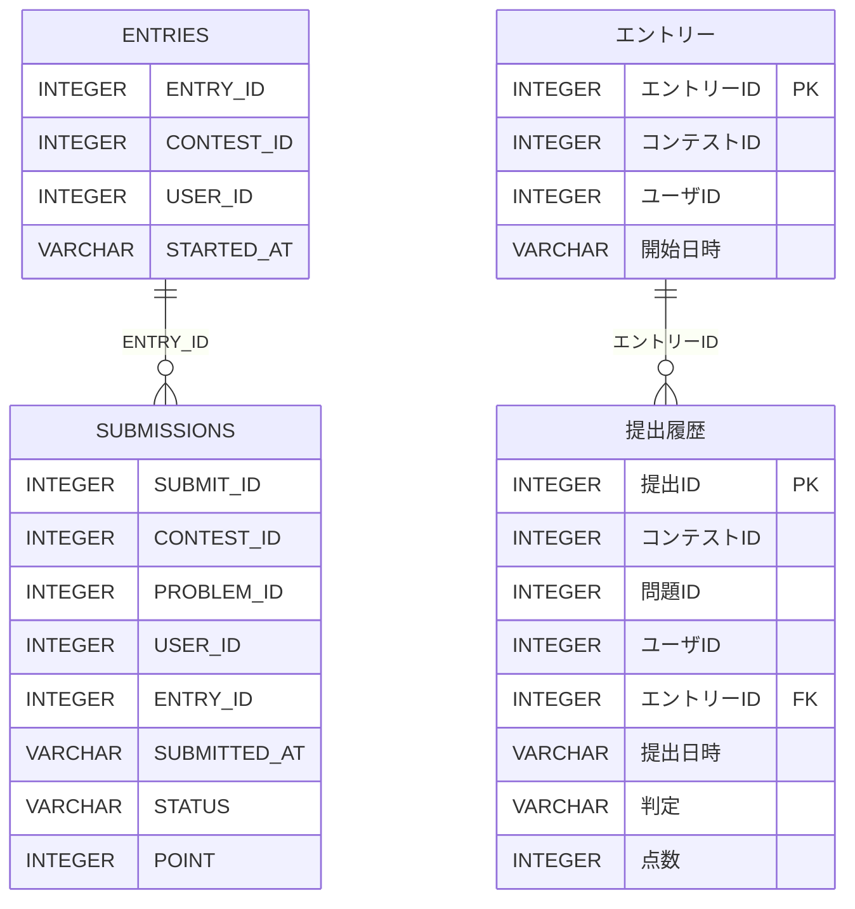

# [順位集計ロジック](https://web.archive.org/web/20250208220740/https://topsic-contest.jp/contests/contest003/problems/contest003-4)

-   配点 : 40点
-   難易度 : 4
-   制限実行時間 : 1000ms
-   制限メモリ使用量 : 128 MB

## 問題

オンラインジャッジシステムを用いたあるコンテストでは、参加者が開催期間中の任意の時間にエントリーを行い、エントリーから60分の制限時間内に提出された解答を対象として順位集計を行う。また、制限時間経過後やコンテスト期間終了後であっても、エントリーに紐づかない提出という扱いで自由に解答を提出し、採点することができる。エントリー情報のテーブル(ENTRIES)と、提出結果テーブル(SUBMISSIONS)が与えられるので、以下の仕様に沿って順位集計を行い、集計結果を表示せよ。なお、本問題のテーブルの設計やSQLによる集計処理は架空のものである。

### 制約

与えられるデータにおいて、以下が保証される。

-   同一ユーザーが、同一問題に対してステータス(STATUS)がACとなるコードを2回以上提出していない。
-   同一ユーザーが、同一時刻に2回以上提出していない。
-   制限時間外に提出された解答のエントリーID(ENTRY_ID)は、NULLがセットされている。

### 順位集計ロジック

合計点数および解答時間を計算し、以下の条件に従って順位を決定する。ただし、これに沿った実装を行う必要はなく、最終的な集計結果が正しければ正答とみなされる。

1.  各参加者について、合計点数、解答時間を求める。計算方法は後述する。
2.  合計点数が異なる場合、合計点数が高い参加者を良い順位とする。
3.  合計点数が同じ場合、解答時間が短い参加者を良い順位とする。
4.  合計点数と解答時間の両方が同じ場合、同じ順位とする。
5.  各参加者の順位の値を、（自分より良い順位となる参加者の人数）+1によって求める。例えば、1位が2人存在する場合、次の順位は3位となる。

### 合計点数の計算方法

制約より、本問題では同一ユーザーが同一問題に対してステータスがACとなるコードを2回以上提出しないことが保証される。したがって、各参加者について以下の操作を行えばよい。

-   提出結果から点数(POINT)の総和を求める。

### 解答時間および誤答数の計算方法

制約より、本問題では同一ユーザーが同一問題に対してステータスがACとなるコードを2回以上提出しないこと、同一ユーザーが同一時刻に2回以上提出していないことが保証される。したがって、各参加者のエントリーに紐づく提出結果について以下の集計を行えばよい。

1.  最後にACを取得したレコードを求め、提出日時(SUBMITTED_AT)と開始日時(STARTED_AT)の時間差（秒）を求める。これを実解答時間とする。
2.  各問題について、ACとなった時刻よりも前に提出された、ACでない解答を問題別誤答数とする。
3.  実解答時間 + (300 * 問題別誤答数の合計) を誤答のペナルティを考慮した最終的な解答時間とする。

より直観的には、「最後に新たに得点を取得したときの、開始日時からの経過秒数」に「1回につき5分の誤答ペナルティ」を加えた時間が解答時間となる。

### その他の条件

-   対象となるコンテストは、CONTEST_ID = 2 とする。
-   合計した点数が0点のデータは集計対象外とする。

表示項目は以下とする。（エイリアスを使用し→の項目名とする）

-   順位(1から順にカウントアップ) → RANK
-   ユーザID → USER_ID
-   ユーザが獲得した点数 → POINT
-   問題提出までにかかった合計時間(ペナルティを含む) → EX_TIME
-   誤答数 → WRONG_ANS

表示順

1.  順位の昇順
2.  誤答数の昇順
3.  ユーザIDの昇順

## 判定内容のサンプル

開始時刻が17:00で下記の提出を行った場合、点数は60点、実解答時間は30分、誤答数は2、解答時間(ペナルティを含む)は40分となる

| 提出時刻　　 | 問題ID　| 判定　| 獲得点数　　| 誤答対象　　                     |
|:-----------|:-------|:-----|:----------|:-------------------------------|
| 17:03      | 1      | WA   | 0         | ◯                              |
| 17:05      | 1      | AC   | 10        |                                |
| 17:15      | 2      | AC   | 20        |                                |
| 17:25      | 3      | WA   | 0         | ◯                              |
| 17:30      | 3      | AC   | 30        |                                |
| 17:31      | 3      | WA   | 0         | ✕ (既にACしているため)　          |
| 17:50      | 4      | WA   | 0         | ✕ (最終的にACしていないため)　     |

## 表示フォーマット

※あくまでフォーマットを示すもので、正解例ではありません。行数も正解とは異なります。

| RANK | USER_ID | POINT | EX_TIME | WRONG_ANS |
|:-----|:--------|:------|:--------|:----------|
| 1    | 164     | 100   | 3252    | 0         |
| 1    | 357     | 100   | 3252    | 0         |
| 3    | 64      | 70    | 2614    | 0         |
| 4    | 426     | 60    | 1540    | 0         |
| 5    | 580     | 60    | 3416    | 0         |
| 6    | 118     | 60    | 5026    | 5         |

## ER図 (半角:物理名、全角:論理名)

## テーブル定義

### ENTRIES

| 主キー | 列名　          | データ型　　| 必須　| デフォルト値 |
|:------|:---------------|:----------|:-----|:-----------|
| ✔︎     | ENTRY_ID       | INTEGER   | ✔︎    | NULL       |
|       | CONTEST_ID     | INTEGER   | ✔︎    | NULL       |
|       | USER_ID        | INTEGER   | ✔︎    | NULL       |
|       | STARTED_AT     | VARCHAR   |      | NULL       |

### SUBMISSIONS

| 主キー | 列名　          | データ型　　| 必須　| デフォルト値 |
|:------|:---------------|:----------|:-----|:-----------|
| ✔︎     | SUBMIT_ID      | INTEGER   | ✔︎    | NULL       |
|       | CONTEST_ID     | INTEGER   | ✔︎    | NULL       |
|       | PROBLEM_ID     | INTEGER   | ✔︎    | NULL       |
|       | USER_ID        | INTEGER   |      | NULL       |
|       | ENTRY_ID       | INTEGER   |      | NULL       |
|       | SUBMITTED_AT   | VARCHAR   |      | NULL       |
|       | STATUS         | VARCHAR   |      | NULL       |
|       | POINT          | INTEGER   |      | NULL       |

## サンプルデータ

### ENTRIES

| ENTRY_ID | CONTEST_ID | USER_ID | STARTED_AT           |
|:---------|:-----------|:--------|:---------------------|
| 10       | 2          | 118     | 2022-07-20 17:00:17  |
| 11       | 2          | 440     | 2022-07-20 17:00:18  |
| 12       | 2          | 164     | 2022-07-20 17:00:20  |
| 13       | 2          | 357     | 2022-07-20 17:00:22  |
| 14       | 2          | 426     | 2022-07-20 17:00:23  |
| 15       | 2          | 618     | 2022-07-20 17:00:28  |
| 16       | 2          | 628     | 2022-07-20 17:00:30  |
| 17       | 2          | 64      | 2022-07-20 17:00:37  |
| 18       | 2          | 580     | 2022-07-20 17:00:38  |
| 19       | 2          | 540     | 2022-07-20 17:00:47  |

### SUBMISSIONS

| SUBMIT_ID | CONTEST_ID | PROBLEM_ID | USER_ID | ENTRY_ID | SUBMITTED_AT           | STATUS | POINT |
|:----------|:-----------|:-----------|:--------|:---------|:----------------------|:-------|:------|
| 2061      | 2          | 5          | 164     | 12       | 2022-07-20 17:02:32   | AC     | 10    |
| 2063      | 2          | 5          | 64      | 17       | 2022-07-20 17:02:43   | AC     | 10    |
| 2064      | 2          | 5          | 118     | 10       | 2022-07-20 17:02:44   | AC     | 10    |
| 2075      | 2          | 5          | 426     | 14       | 2022-07-20 17:03:42   | AC     | 10    |
| 2077      | 2          | 5          | 440     | 11       | 2022-07-20 17:03:59   | AC     | 10    |
| 2082      | 2          | 5          | 618     | 15       | 2022-07-20 17:04:17   | AC     | 10    |
| 2087      | 2          | 5          | 628     | 16       | 2022-07-20 17:05:30   | WA     | 0     |
| 2091      | 2          | 5          | 540     | 19       | 2022-07-20 17:06:12   | WA     | 0     |
| 2103      | 2          | 5          | 580     | 18       | 2022-07-20 17:08:23   | AC     | 10    |
| 2107      | 2          | 6          | 357     | 13       | 2022-07-20 17:09:47   | AC     | 20    |
| 2110      | 2          | 6          | 64      | 17       | 2022-07-20 17:10:06   | AC     | 20    |
| 2112      | 2          | 5          | 357     | 13       | 2022-07-20 17:00:10   | AC     | 10    |
| 2114      | 2          | 5          | 628     | 16       | 2022-07-20 17:10:43   | AC     | 10    |
| 2130      | 2          | 6          | 164     | 12       | 2022-07-20 17:13:26   | AC     | 20    |
| 2136      | 2          | 6          | 618     | 15       | 2022-07-20 17:14:22   | AC     | 20    |
| 2139      | 2          | 6          | 426     | 14       | 2022-07-20 17:15:13   | AC     | 20    |
| 2146      | 2          | 6          | 118     | 10       | 2022-07-20 17:17:01   | AC     | 20    |
| 2162      | 2          | 6          | 440     | 11       | 2022-07-20 17:19:54   | WA     | 0     |
| 2172      | 2          | 7          | 164     | 12       | 2022-07-20 17:22:17   | AC     | 30    |
| 2176      | 2          | 7          | 64      | 17       | 2022-07-20 17:22:49   | WA     | 0     |
| 2192      | 2          | 7          | 618     | 15       | 2022-07-20 17:25:22   | WA     | 0     |
| 2198      | 2          | 6          | 440     | 11       | 2022-07-20 17:26:02   | WA     | 0     |
| 2199      | 2          | 7          | 426     | 14       | 2022-07-20 17:26:03   | AC     | 30    |
| 2206      | 2          | 6          | 440     | 11       | 2022-07-20 17:27:00   | WA     | 0     |
| 2219      | 2          | 6          | 628     | 16       | 2022-07-20 17:29:42   | WA     | 0     |
| 2229      | 2          | 6          | 440     | 11       | 2022-07-20 17:31:00   | WA     | 0     |
| 2242      | 2          | 6          | 628     | 16       | 2022-07-20 17:32:34   | AC     | 20    |
| 2270      | 2          | 6          | 440     | 11       | 2022-07-20 17:30:45   | AC     | 20    |
| 2296      | 2          | 8          | 357     | 13       | 2022-07-20 17:37:30   | AC     | 40    |
| 2303      | 2          | 7          | 118     | 10       | 2022-07-20 17:40:07   | WA     | 0     |
| 2320      | 2          | 7          | 118     | 10       | 2022-07-20 17:42:40   | WA     | 0     |
| 2329      | 2          | 8          | 64      | 17       | 2022-07-20 17:44:11   | AC     | 40    |
| 2346      | 2          | 7          | 64      | 17       | 2022-07-20 17:46:42   | WA     | 0     |
| 2359      | 2          | 7          | 64      | 17       | 2022-07-20 17:48:54   | WA     | 0     |
| 2362      | 2          | 8          | 618     | 15       | 2022-07-20 17:49:58   | WA     | 0     |
| 2363      | 2          | 7          | 580     | 18       | 2022-07-20 17:49:59   | AC     | 30    |
| 2375      | 2          | 7          | 118     | 10       | 2022-07-20 17:51:16   | WA     | 0     |
| 2387      | 2          | 7          | 118     | 10       | 2022-07-20 17:52:33   | WA     | 0     |
| 2400      | 2          | 7          | 618     | 15       | 2022-07-20 17:53:40   | WA     | 0     |
| 2411      | 2          | 7          | 64      | 17       | 2022-07-20 17:54:32   | WA     | 0     |
| 2412      | 2          | 8          | 164     | 12       | 2022-07-20 17:54:32   | AC     | 40    |
| 2426      | 2          | 7          | 64      | 17       | 2022-07-20 17:56:28   | WA     | 0     |
| 2429      | 2          | 7          | 357     | 13       | 2022-07-20 17:54:34   | AC     | 30    |
| 2436      | 2          | 7          | 118     | 10       | 2022-07-20 17:57:19   | WA     | 0     |
| 2437      | 2          | 7          | 618     | 15       | 2022-07-20 17:57:20   | WA     | 0     |
| 2441      | 2          | 6          | 580     | 18       | 2022-07-20 17:57:34   | AC     | 20    |
| 2449      | 2          | 7          | 118     | 10       | 2022-07-20 17:59:03   | AC     | 30    |
| 2451      | 2          | 8          | 580     | 18       | 2022-07-20 17:59:14   | WA     | 0     |
| 2453      | 2          | 7          | 64      | 17       | 2022-07-20 17:59:38   | WA     | 0     |
| 2454      | 2          | 7          | 440     | 11       | 2022-07-20 17:59:41   | RE     | 0     |
| 2490      | 2          | 7          | 618     | NULL    | 2022-07-20 18:04:44   | WA     | 0     |
| 2512      | 2          | 7          | 618     | NULL    | 2022-07-20 18:08:22   | WA     | 0     |
| 2558      | 2          | 7          | 618     | NULL    | 2022-07-20 18:15:13   | WA     | 0     |
| 2566      | 2          | 7          | 618     | NULL    | 2022-07-20 18:16:19   | AC     | 30    |
| 2573      | 2          | 7          | 618     | NULL    | 2022-07-20 18:17:04   | AC     | 30    |
| 2595      | 2          | 8          | 618     | NULL    | 2022-07-20 18:19:48   | WA     | 0     |
| 2703      | 2          | 8          | 618     | NULL    | 2022-07-20 18:34:06   | WA     | 0     |
| 2735      | 2          | 8          | 618     | NULL    | 2022-07-20 18:38:06   | AC     | 40    |
| 4544      | 2          | 7          | 64      | NULL    | 2022-07-21 08:33:03   | WA     | 0     |
| 4545      | 2          | 7          | 64      | NULL    | 2022-07-21 08:39:34   | WA     | 0     |
| 4546      | 2          | 7          | 64      | NULL    | 2022-07-21 08:41:06   | WA     | 0     |
| 4547      | 2          | 7          | 64      | NULL    | 2022-07-21 08:46:10   | AC     | 30    |
| 4610      | 2          | 8          | 426     | NULL    | 2022-07-21 15:21:43   | AC     | 40    |
| 5909      | 2          | 8          | 580     | NULL    | 2022-09-21 11:51:41   | WA     | 0     |
